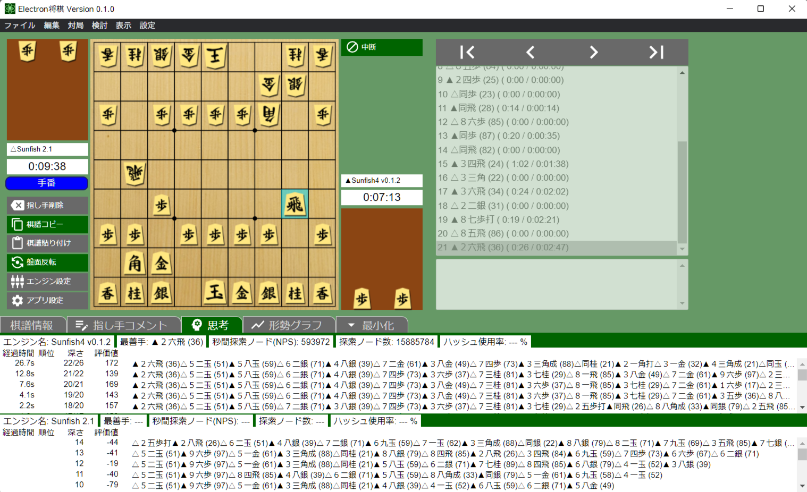
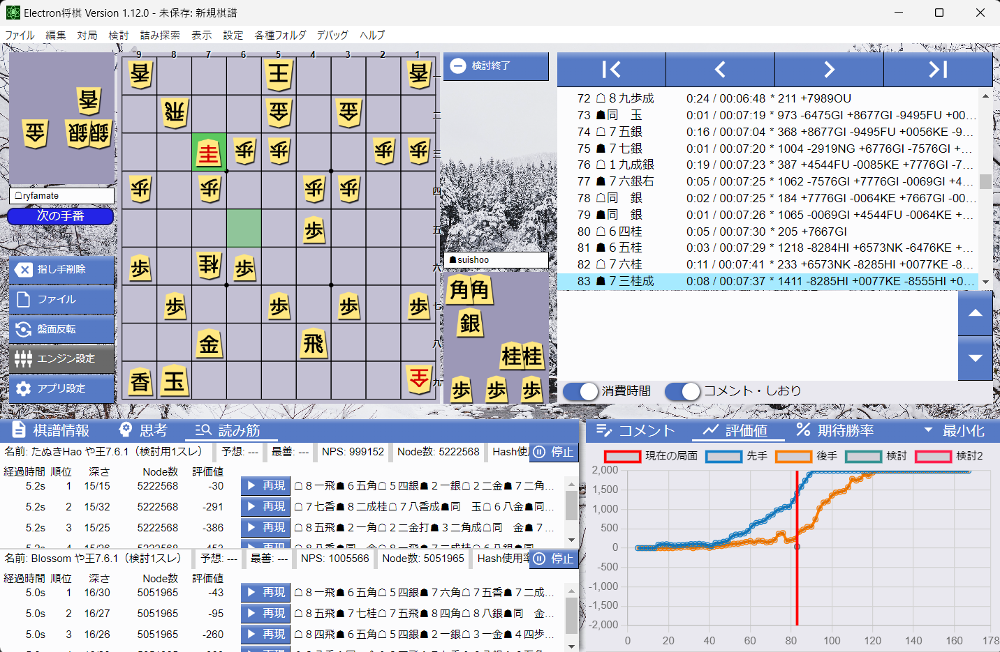
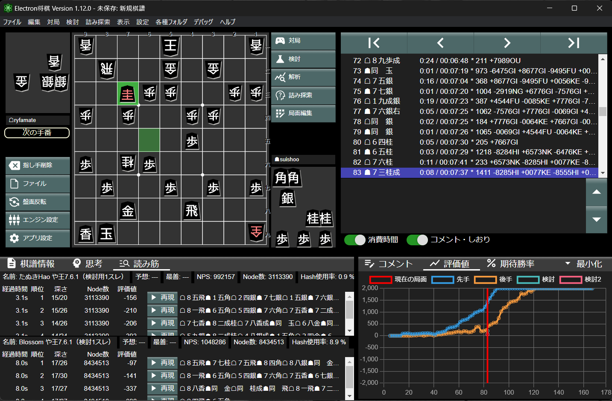

# Electron Shogi

[](https://github.com/sunfish-shogi/electron-shogi/actions/workflows/test.yml)
[](https://codecov.io/gh/sunfish-shogi/electron-shogi)

[日本語](./README.md)

This is Shogi GUI app.
You can play Shogi with AI and manage records.

You can use this app with any Shogi engine(AI) based on [USI Protocol](http://shogidokoro.starfree.jp/usi.html), just like [将棋所](http://shogidokoro.starfree.jp/).

## Concept

We can already use excellent softwares such as 将棋所 and [ShogiGUI](http://shogigui.siganus.com/) etc.
However, most of them are not open-source projects.
The authority of Shogi AI advocates [importance of open-source Shogi GUI](https://yaneuraou.yaneu.com/2022/01/15/new-gui-for-shogi-is-needed-to-improve-the-usi-protocol/).
Electron Shogi is open-source. And you can use/modify under only few limits.

Electron Shogi is developed by [Electron](https://www.electronjs.org/) which is web based GUI framework.
We want to use this project to wide usages by making use of modern web technologies on the future.
Currently, you can use the part of features on your web browser.
Electron based app bundles Chromium, so it is easy to keep quality regardless of OS or its versions.

These days, 2-in-1 tablet and convertible PC are becoming popular.
So, it is possible to play shogi on PC with touch screen.
However, legacy desktop Shogi apps have very small UI components. So it's not good for compatibility with touch display.
We design this app to have operability for touch devices.

## Website

https://sunfish-shogi.github.io/electron-shogi/

You can try web version from the website.

## Wiki

https://github.com/sunfish-shogi/electron-shogi/wiki

## Screenshots







## Downloads

You can download any versions from [Releases](https://github.com/sunfish-shogi/electron-shogi/releases).

## Bug Reports / Suggestions

If you have a GitHub account, please create Issue or Pull Request.
If you want to send large changes, please create Issue before development.

If not, please send message from [Web Form](https://form.run/@sunfish-shogi-1650819491).

You can see the development progress at [Project Board](https://github.com/users/sunfish-shogi/projects/1/views/1).

## Development

### Requirements

- Node.js

### Setup

```
git clone https://github.com/sunfish-shogi/electron-shogi.git
cd electron-shogi
npm install
```

### Launch

```
# Electron App
npm run electron:serve

# Web App
npm run serve
```

### Release Build

```
# Electron App (Installer)
npm run electron:build

# Electron App (Portable)
npm run electron:portable

# Web App
npm run build
```

### Unit Tests

```
# test only
npm test

# coverange report
npm run coverage
```

### Lint

```
npm run lint
```

## Licences

### Electron Shogi

[MIT License](LICENSE)

### Icon Images

This app uses [Material Icons](https://google.github.io/material-design-icons/) saved in [/public/icon](https://github.com/sunfish-shogi/electron-shogi/tree/main/public/icon).
These assets are provided under [Apache License 2.0](https://www.apache.org/licenses/LICENSE-2.0.txt).

### Dependencies

See [THIRD PARTY LICENSES](https://sunfish-shogi.github.io/electron-shogi/third-party-licenses.html) for libraries used from renderer process.

electron-builder bundles license files of Electron and Chromium into artifacts.
